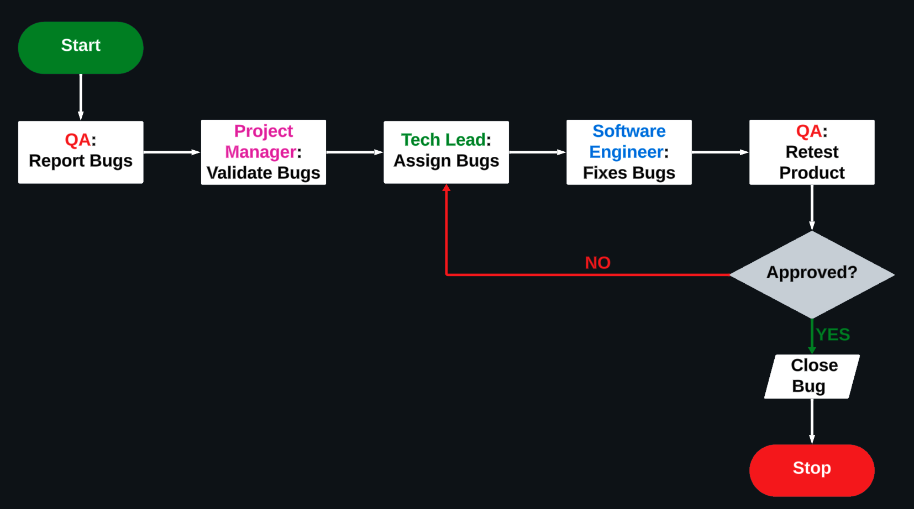

# Test Plan
 

| Authors | Abderrazaq MAKRAN and Raphael PROUDHON |
|---|---|
|Created|01/22/2024|
|Last Updated| 01/25/2024 |
|Status| Draft|

 

# Revision and Sign off

## Document History
| Version | Date | Author | Description of Changes|
|---|---|---|---|
|1| 01/22/2024 | Abderrazaq MAKRAN and Raphael PROUDHON| Draft |
|1.1| 01/23/2024|Abderrazaq MAKRAN and Raphael PROUDHON | Draft | 
|1.2| 01/24/2024|Abderrazaq MAKRAN and Raphael PROUDHON | Draft | 
|1.3| 01/25/2024|Abderrazaq MAKRAN and Raphael PROUDHON | Draft | 

## Approval List
|Name|Role|Approver/Reviewer|Approval/ Review Date|
|---|---|---|---|

 

# Table of Contents
- [1. GLOSSARY](#1-glossary)
- [2. INTRODUCTION](#2-introduction)
  - [2.1 Purpose](#21-purpose)
  - [2.2 Project Overview](#22-project-overview)
  - [2.3 Audience](#23-audience)
- [3. TEST STRATEGY](#3-test-strategy)
  - [3.1 Test Objectives](#31-test-objectives)
  - [3.2 Testing Environment](#32-testing-environment)
  - [3.3 Test Principles](#33-test-principles)
  - [3.4 Scope and Levels of Testing](#34-scope-and-levels-of-testing)
    - [3.4.1 Define Scope of Testing](#341-define-scope-of-testing)
    - [3.4.2 Identify Testing Type](#342-identify-testing-type)
    - [3.4.3 Document Risk & Issues](#343-document-risk--issues)
- [4. EXECUTION STRATEGY](#4-execution-strategy)
  - [4.1 Criteria](#41-criteria)
    - [4.1.1 Suspension Criteria](#411-suspension-criteria)
    - [4.1.2 Entry Criteria and Exit Criteria](#412-entry-criteria-and-exit-criteria)
  - [4.2 Github Issues](#42-github-issues)
  - [4.3 Test Cases](#43-test-cases)
  - [4.4 Validation and Bug Report Managment](#44-validation-and-bug-report-management)
  - [4.5 Test Metrics](#45-test-metrics)
  - [4.6 Bug Tracking & Reporting](#46-bug-tracking--reporting)
- [5. TEST MANAGMENT PROCESS](#5-test-management-process)
  - [5.1 Test Managment Tool](#51-test-managment-tool)

## 1. GLOSSARY
 

|Term|Definition|Source|
|---|---|---|
|C |C is a general-purpose computer programming language. It was created in the 1970s by Dennis Ritchie, and remains very widely used and influential. By design, C's features cleanly reflect the capabilities of the targeted CPUs.| [Wikipedia](https://en.wikipedia.org/wiki/C_(programming_language))|
|Virtual Processor | A virtual processor is a representation of a physical processor core to the operating system of a logical partition that uses shared processors.| [IBM](https://www.ibm.com/docs/en/power8/8408-44E?topic=processors-virtual)|
|Assembly language| In computer programming, assembly language, often referred to simply as assembly and commonly abbreviated as ASM or asm, is any low-level programming language with a very strong correspondence between the instructions in the language and the architecture's machine code instructions.| [Wikipedia](https://en.wikipedia.org/wiki/Assembly_language)|
| Operating Sytem | An operating system (OS) is system software that manages computer hardware and software resources, and provides common services for computer programs.| [Wikipedia](https://en.wikipedia.org/wiki/Operating_system)|
|IDE: Integrated Development Environment | An integrated development environment is a software application that provides comprehensive facilities for software development. An IDE normally consists of at least a source-code editor, build automation tools, and a debugger. (Visual Studio Code)| [Wikipedia](https://en.wikipedia.org/wiki/Integrated_development_environment)|
|Compiler GCC|The GNU Compiler Collection is an optimizing compiler produced by the GNU Project supporting various programming languages, hardware architectures and operating systems. The Free Software Foundation distributes GCC as free software under the GNU General Public License.| [Wikipedia](https://en.wikipedia.org/wiki/GNU_Compiler_Collection)|
|Test case|In software engineering, a test case is a specification of the inputs, execution conditions, testing procedure, and expected results that define a single test to be executed to achieve a particular software testing objective, such as to exercise a particular program path or to verify compliance with a specific requirement.|[Wikipedia](https://en.wikipedia.org/wiki/Test_case)| 
| Project Manager | A project manager is a professional in the field of project management. Project managers have the responsibility of the planning, procurement and execution of a project, in any undertaking that has a defined scope, defined start and a defined finish; regardless of industry.| [Wikipedia](https://en.wikipedia.org/wiki/Project_manager)|
| Program Manager | He is a strategic project-management professional whose job is to help oversee and coordinate the various projects, products, and other strategic initiatives across an organization.| [ProductPlan](https://www.productplan.com/glossary/program-manager/#:~:text=Definition%3A%20A%20program%20manager%20is,strategic%20initiatives%20across%20an%20organization.) |
| Technical Lead | He oversees the technical aspects of a software team by making architectural and design decisions, guiding team members in technical matters, and supervising system modifications. |[Ironhack](https://www.ironhack.com/gb/blog/what-is-a-tech-lead#:~:text=A%20technical%20lead%20%E2%80%93%20or%20tech,matters%2C%20and%20supervising%20system%20modifications.)|
|Software Engineer | He apply engineering principles and knowledge of programming languages to build software solutions for end users. Software engineers design and develop computer games, business applications, operating systems, network control systems, and middleware—to name just a few of the many career paths available.| [Michigan Technological University](https://www.mtu.edu/cs/undergraduate/software/what/#:~:text=of%20software%20applications.-,Software%20engineers%20apply%20engineering%20principles%20and%20knowledge%20of%20programming%20languages,the%20many%20career%20paths%20available.)|
| QA (Quality Assurance) |A QA engineer creates tests that identify issues with software before a product launch. These tests entail other tasks such as developing and running new tests and reporting their results to stakeholders, who will collaborate to fix program bugs or problems.| [Workable](https://resources.workable.com/qa-engineer-job-description#:~:text=What%20does%20a%20Quality%20Assurance,fix%20program%20bugs%20or%20problems.)|

 

## 2. INTRODUCTION

- ### 2.1 Purpose

  - The purpose of this test plan is to ensure the functionality, reliability, and correctness of the virtual processor and interpreter. The document introduces:
  
    -  **Test Strategy:**
    -  **Execution Strategy:**
    -  **Test Management:**

- ### 2.2 Project Overview

  - Algosup asked us to build a virtual processor and interpreter for running assembly code. It's an open project for students to learn low-level programming. We're keeping things clear with easy-to-follow guides. Our goal? Create a friendly space for anyone curious about assembly language and system programming.

- ### 2.3 Audience

  - The primary audience for this test plan includes project team members, each with distinct roles:

      - **Technical Team:**

        - Responsible for executing tasks outlined in this document.
        - Contribute insights and recommendations regarding the test plan.

      - **Project Manager:**

        - Plans testing activities within the overall project schedule.
        - Reviews, approves, and holds accountability for the test plan.
        - Tracks the performance of the testing activities.

      - **QA's Members:**

          - Ensures the test plan and deliverables are consistent with the project's design.
          - Provides the necessary testing environment.
          - Adheres to procedures related to bug fixes programming.

  This collaborative approach ensures that the test plan not only meets technical requirements but also aligns with overall project goals.

## 3. TEST STRATEGY
- ### 3.1 Test Objectives
  - This test plan is focused on rigorously assessing the virtual processor and interpreter in our project, emphasizing functionality, reliability, and correctness. We aim to validate precise execution of assembly code, assess the reliability of the virtual processor under diverse scenarios, and ensure accurate results from the interpreter. Additionally, we prioritize educational value, providing a testing framework aligned with learning goals for students and developers exploring low-level programming concepts. Clear documentation and guides ensure accessibility for a broad audience. This testing approach aims not only to validate technical robustness but also to highlight the project's educational merits in the realm of low-level programming.

- ### 3.2 Test Environment
  - **Operating System:** Windows and MacOS
  - **Compiler:** GCC 13.2
  - **IDE:** Visual Studio Code 1.85
  - **Hardware:**  
    - [MacBook Air 2020](https://www.apple.com/fr/macbook-air-m1/)
      - 13.3 inch (2560 x 1600)
      - macOS Sonoma 14.2
      - Apple M1 Chip

    - [Lenovo Thinkbook 14](https://pcsupport.lenovo.com/us/en/products/laptops-and-netbooks/thinkbook-series/thinkbook-14-iil/20sl)
      - Windows 11 Pro
      - 14 inch (1920 x 1080)
      - Processor: Intel(R) Core(TM) i7-1165G7 CPU @ 2.80GHz
      - RAM: 16.0 GB
      - System type: 64-bit operating system, x64-based processor

    - [ThinkPad E14 Gen 5](https://www.lenovo.com/fr/fr/p/laptops/thinkpad/thinkpade/thinkpad-e14-gen-5-(14-inch-intel)/len101t0064)
      - Windows 11 Pro
      - 14 inch (1920 x 1080)
      - Processor: 13th Gen Intel(R) Core(TM) i7-1355U, 1700 Mhz
      - RAM: 16.0 GB
      - System type: 64-bit operating system, x64-based processor

- ### 3.3 Test Principles 
  
    - Tests will be focused on meeting the objectives and quality 
    
   

    - Testing processes will be well defined, yet flexible, with the ability to change as needed. 
    
     

    - There will be common, consistent procedures for all teams supporting testing activities

   

    - Testing activities will build upon previous stages to avoid redundancy or duplication of effort

   

    - Testing will be divided into distinct phases, each with clearly defined objectives and goals.

- ## 3.4 Scope and Levels of Testing
    - ### 3.4.1 Define Scope of Testing
      - #### In scope 
        - we will be testing each part of the software, each instruction.
      - #### Out scope
        -
    - ### 3.4.2 Identify Testing Type
      - #### Agile testing
        we are going to use an agile testing strategy so as soon as new versions are realesed by the development team we will be able to test it as soon as possible and give a feedback in short delays.
    - ### 3.4.3 Document Risk & Issues
    - ### 3.4.4 Create Test Logistics
    -  
## 4. EXECUTION STRATEGY
  - ### 4.1 Criteria
    - #### 4.1.1 Suspension Criteria
      - The purpose of implementing suspension criteria is to avoid unnecessary expenditure of effort and resources. When testing faces impediments such as defects, environmental issues, or other obstacles that hinder effective progress, it is prudent to temporarily halt testing activities until these issues are addressed. This strategic pause optimizes the utilization of testing resources and contributes to maintaining the precision and validity of test results.
       
       
    
    - #### 4.1.2 Entry Criteria and Exit Criteria
      - Entry criteria define the conditions that must be fulfilled before the testing process can commence. They serve as a set of prerequisites and ensure that the testing environment is ready for effective and meaningful testing. Entry criteria typically include aspects such as:
        - **The availability of the test environment** 
        - **Completion of necessary documentation**
        - **Readiness of unit test** 
        - **The successful completion of any prerequisite testing phases.** 
    
        Meeting entry criteria helps ensure that testing can proceed efficiently and that the results obtained are reliable.
      
      - Exit criteria, on the other hand, establish the conditions that must be met for testing to be considered complete and successful. They define the point at which testing activities can be concluded and the software can move to the next phase or be released. Exit criteria may include factors such as:
        - **Achieving a certain level of test coverage** 
        - **The successful execution of test cases, the resolution of critical bugs** 
        - **The commitment of the whole code on Github repository** 
  
        Meeting exit criteria is crucial for making informed decisions about the readiness of the software for the next phase.
  
  - ### 4.2 GitHub Issues

    GitHub Issues is a built-in issue-tracking tool that allows us to create and manage issues and assign them to team members.
    
    We define:
    
    - **Bugs:** Unexpected problems or code errors.
    - **Errors:** Includes all errors that do not originate in the code.
    - **Deadlines:** Specific deadlines for project stages to ensure timely
      delivery.
    - **Documentation:** Request for documentation on a specific function or group of functions in the code.
    - **Task allocation:** Assignment and tracking of specific responsibilities.
   

  
  - ### 4.3 Test Cases
     To ensure comprehensive testing of all features and thorough identification of potential bugs, test cases will be generated using GitHub Issues as a collaborative tool. This approach facilitates clear visibility for QA's team members, outlining what needs testing and tracking the testing progress. It also serves as a centralized platform for the entire team to stay informed about pending features or those yet to be implemented.
 
  A standardized template for creating these tickets has been formulated and is accessible in the [testCase.yml]() file, providing consistency and structure to the testing process:
    
      - To enhance clarity, each test case will be meticulously crafted and documented within GitHub Issues, designated with the label "Test Case." 
      - This ensures that every team member can readily comprehend the testing requirements. 
      - Assignees for these test cases will include both QA's and individuals responsible for the respective features. 
  
  - ### 4.4 Validation and Bug Report Management
    - The bugs will be tracked through tickets on Github issues only. The technical team will gather information on a daily basis from Github, and request additional details from the project manager and the QA. The technical team will work on fixes. The title must be clear and explicit so that everyone can understand what bug it is. Each bug report will be created on GitHub issues with the label "bug". The people in charge of resolving the bug will be set as assignees.
   
    - A template for those tickets has been created : 
       
    - It is QA's responsibility to open a bug report, link it to the corresponding test case, assign an initial severity, retest and close the bug;
    
    - It is Project Manager's responsibility to review the severity of the bugs and facilitate with the technical team the fix and its implementation, communicate with QA's when the test can continue or should be halt, request the QA's to retest, and modify status as the bug progresses through the cycle; 
   
    - It is Technical team's responsibility to review the bug report on a daily basis, ask for details if necessary, fix the bug, communicate to the Project Manager the fix is done.
   
    - Bug found during the testing will be categorized according to the bug reporting template implemented directly on Github issues and the categories are:
  
      | Severity | Impact |
      |---|---|
      |1 (Critical) | - This bug is critical enough to crash the system, cause file corruption, or cause potential data loss.   - It causes an abnormal return to the operating system (crash or a system failure message appears).   - It causes the application to hang and requires re-booting the system.|
      |2 (High) | -It causes a lack of vital program functionality with workaround.|
      |3 (Medium) |- This Bug will degrade the quality of the System. However there is an intelligent workaround for achieving the desired functionality, for example through another screen.   - This bug prevents other areas of the product from being tested. However other areas can be independently tested.| 
      |4 (Low) | - There is an insufficient or unclear error message, which has minimum impact on product use.|

  
  - ### 4.5 Test Metrics
  - ### 4.6 Bug tracking & Reporting
     
   
## 5. TEST MANAGEMENT PROCESS
  - ### 5.1 Test Managment Tool
    - Github issues is the tool used for Test Management. All testing artifacts such as Test cases, test results are updated in the Github issues.
   
    - Project specific folder structure will be created in Github to manage the status of this project.
     
    - Each resource in the team will be provided with Read/Write access to add/modify Test cases.
   
    - During the Test Design phase, all test cases are written directly with this templates: [testcase.yml](). Any change to the test case will be directly updated in Github issues. 
     
    - Each Tester will directly access their respective assigned test cases and update the status of each executed step in Github issues.
     
    - Any bug encountered will be raised in Github issues to the particular Test case.
   
    - During bug fix testing, bugs are re-assigned back to the QA's to verify the bug fix. The QA's verifies the bug fix and updates the status directly in Github issues.
   
    - Various reports can be generated from Github issues to provide status of Test execution. For example, Status report of Test cases executed, Passed, Failed, No. of open Bugs, Severity wise bugs etc.

## Test Plan approval

| Role | Name | Signature | Date |
|---|---|---|---|
| Project Manager | Matteo LEFIN |  | |
| Program Manager | Gael MALVAR |  | |
| Tech Lead | Robin DEBRY |  | |
| Software Developer | Camille GAYAT |  | |
| Software Developer | David CUAHONTE |  | |
| Quality Assurance | Raphaël PROUDHON |  | |
| Quality Assurance | Abderrazaq MAKRAN |   | |
