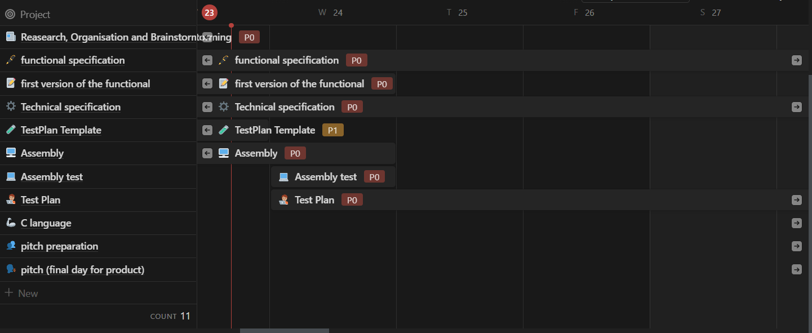

# Functional Specifications | Virtual Processor Team 7

---

<details>
<summary> 📖 Table of content 📖 </summary>

- [Functional Specifications | Virtual Processor Team 7](#functional-specifications--virtual-processor-team-7)
  - [I. Introduction](#i-introduction)
    - [1. Glossary](#1-glossary)
    - [2. Project Overview](#2-project-overview)
    - [3. Project Definition](#3-project-definition)
      - [➭ Vision](#-vision)
      - [➭ Objectives](#-objectives)
      - [➭ Scope](#-scope)
      - [➭ Deliverables](#-deliverables)
      - [➭ Personas](#-personas)
        - [★ Persona 1 - Emma Turner](#-persona-1---emma-turner)
        - [★ Persona 2 - Alex Garcia](#-persona-2---alex-garcia)
    - [4. Project Organisation](#4-project-organisation)
      - [➭ Stakeholders](#-stakeholders)
      - [➭ Project Reviewers](#-project-reviewers)
    - [5. Project Plan](#5-project-plan)
      - [➭ Retroplanning](#-retroplanning)
      - [➭ Milestones](#-milestones)
      - [➭ Resources/Financial plan](#-resourcesfinancial-plan)
        - [★ Human Resources](#-human-resources)
        - [★ Development Tools](#-development-tools)
        - [★ Associated costs](#-associated-costs)
      - [➭ Assumptions/Constraints](#-assumptionsconstraints)
        - [★ Team member availability](#-team-member-availability)
        - [★ Time constraints](#-time-constraints)
  - [II. Functional Requirements](#ii-functional-requirements)
    - [1. System Capabilities](#1-system-capabilities)
      - [➭ 1.1 Data Handling:](#-11-data-handling)
      - [➭ 1.2 Calculations:](#-12-calculations)
      - [➭ 1.3 Branching:](#-13-branching)
      - [➭ 1.4 Platform Independence:](#-14-platform-independence)
        - [★ C standard Libraries](#-c-standard-libraries)
      - [➭ 1.5 Error Handling and Detection:](#-15-error-handling-and-detection)
    - [2. Assembly Language](#2-assembly-language)
      - [➭ Language Design](#-language-design)
      - [➭ Instructions](#-instructions)
        - [★ 1. Storing an immediate value into a register:](#-1-storing-an-immediate-value-into-a-register)
        - [★ 2. Copying the value of a register into another register:](#-2-copying-the-value-of-a-register-into-another-register)
        - [★ 3. Reading the value of the memory at the address contained by a register and storing it into another register:](#-3-reading-the-value-of-the-memory-at-the-address-contained-by-a-register-and-storing-it-into-another-register)
        - [★ 4. Storing the value of a register into memory at the address contained by another register:](#-4-storing-the-value-of-a-register-into-memory-at-the-address-contained-by-another-register)
        - [★ 5. Comparing the content of registers:](#-5-comparing-the-content-of-registers)
        - [★ 6. Jumping unconditionally to a label:](#-6-jumping-unconditionally-to-a-label)
        - [★ 7. Jumping conditionally to a label:](#-7-jumping-conditionally-to-a-label)
        - [★ 8. Jumping conditionally to a label](#-8-jumping-conditionally-to-a-label)
        - [★ 9. Calling a subroutine:](#-9-calling-a-subroutine)
        - [★ 10. Returning from a subroutine:](#-10-returning-from-a-subroutine)
        - [★ 11. The 4 basic arithmetic operations: addition, subtraction, multiplication, and division:](#-11-the-4-basic-arithmetic-operations-addition-subtraction-multiplication-and-division)
        - [★ 12. The 4 basic logical operations: OR, AND, XOR, and NOT:](#-12-the-4-basic-logical-operations-or-and-xor-and-not)
        - [★ 13. Ending a program](#-13-ending-a-program)
        - [★ 14. Printing to the screen:](#-14-printing-to-the-screen)
      - [➭ Example of use](#-example-of-use)
      - [➭ Machine Code](#-machine-code)
  - [III. Non-Functional Requirements](#iii-non-functional-requirements)
      - [➭ Performance](#-performance)
      - [➭ Portability](#-portability)
      - [➭ Reliability](#-reliability)
      - [➭ Scalability](#-scalability)
  - [IV. Conclusion](#iv-conclusion)

</details>

---


## I. Introduction


### 1. Glossary


| Terms used | Definition |
|---|---|
| Assembler | A program that translates assembly language into machine code. |
| Semantic Validity | Ensuring that the meaning of the assembly code is correct and adheres to the intended functionality. |
| Machine Code | The low-level code that is directly executed by the computer's central processing unit (CPU). |
| Virtual Processor | A virtual processor refers to a simulated or emulated instance of a central processing unit (CPU) that operates in a virtualized environment. It mimics the behavior of a physical processor, allowing the execution of instructions and processing of data, often used for testing, development, or educational purposes. |
| C language | The C programming language is a general-purpose, procedural programming language developed by Dennis Ritchie in the early 1970s. It is widely used for system and application software development due to its efficiency, portability, and powerful features. C serves as the foundation for many other programming languages. |
| GCC | GCC, or the GNU Compiler Collection, is a suite of compilers developed by the Free Software Foundation (FSF). It includes compilers for various programming languages, with a primary focus on C, C++, and Fortran. GCC is renowned for its open-source nature, portability, and support for multiple platforms. |
| IDE | An Integrated Development Environment (IDE) is a comprehensive software application that provides developers with a centralized platform for coding, debugging, testing, and deploying software. It typically includes a source code editor, debugger, build automation tools, and other features to enhance the development workflow. |
| Compiler | A compiler is a software tool that translates high-level source code written in programming languages like C, C++, or Java into machine code or an intermediate code. The resulting executable or intermediate code can be run on a computer. Compilers play a crucial role in the software development process by converting human-readable code into a form understandable by computers. |


### 2. Project Overview


The aim of this document is to provide a thorough functional specification for the Virtual Processor Project of Team 7. This endeavor encompasses the development of a virtual processor tailored to execute assembly code. We will virtualize the processor using C programming language and the GCC compiler.


### 3. Project Definition


#### ➭ Vision


The fundamental objective of this project is to design and implement a virtual processor capable of executing assembly code. This vision revolves around the creation of a minimalist assembly language specific to the virtual processor, meeting the requirements asked in the call for tenders. The assembly language thus defined will comprise a series of key instructions, including the storage of immediate values in registers, memory manipulation, basic arithmetic and logic operations, and flow control mechanisms.


#### ➭ Objectives


- Design a minimalist assembly language for the virtual processor, respecting the instructions as asked in the call for tenders.
- Implement a C language program capable of reading a text file containing programs written in the defined assembly language.
- Validate the syntax of assembly programs to guarantee their semantic validity.
- Set up virtual system calls to display text in a virtual terminal, enabling visualization of assembly code execution.
- Integrate debugging functions, such as display of register contents, to facilitate the development and verification of assembly code.


#### ➭ Scope


| In Scope |
|---|
| Design a Virtual Processor |
| Minimalist Assembly Language |
| Implementation of an Interpreter |
| Syntax Validation |
| Debugging Features |

| Out of Scope |
|---|
| Compatibility with high-level languages |
| Dive deeper in Assembly |


#### ➭ Deliverables


| Name | Type | Deadline |
|---|---|---|
| Functional Specifications Document | Document (markdown) | 01/30/2024 |
| Technical Specifications Document | Document (markdown) | 02/09/2024 |
| Weekly Reports | Document (markdown) | Every Friday |
| Test Plan | Document (markdown) | 02/16/2024 |
| Final product | Program | 02/23/2024 |


#### ➭ Personas


##### ★ Persona 1 - Emma Turner

Introduction:

Emma Turner, a 32-year-old software engineer, is currently based in Seattle. With a background in developing web applications, she is now eager to explore low-level programming and assembly language. Emma works for a startup that focuses on innovative tech solutions.

Goals:

- Emma's main goal is to acquire proficiency in assembly language to broaden her skill set. She seeks a virtual processor that integrates seamlessly with her Windows workstation. The simplicity of the language and accessibility are crucial factors for her successful transition to low-level programming.

Challenges:

- Emma faces the challenge of adapting to a new programming paradigm. As a result, she looks for a virtual processor that provides clear documentation and support to aid in her learning journey. The compatibility with her Windows environment is essential for a smooth integration into her current workflow.

##### ★ Persona 2 - Alex Garcia

Introduction:

Alex Garcia, a 25-year-old junior software developer, recently joined a tech company in Los Angeles. Having expertise in high-level languages like Python, he is eager to explore assembly language for a more in-depth understanding of computer architecture.

Goals:

- Alex's primary goal is to grasp the fundamentals of assembly language to enhance his overall programming knowledge. He is interested in a virtual processor that supports macOS, as she frequently switches between his MacBook and a Windows machine. A straightforward and intuitive instruction set is vital for Alex's successful adoption of the new language.

Challenges:

- As a junior developer, Alex may find certain low-level programming concepts challenging. Hence, he looks for a virtual processor with a supportive community and learning resources. The ability to seamlessly switch between macOS and Windows without compatibility issues is crucial for his development workflow.


### 4. Project Organisation


#### ➭ Stakeholders


The stakeholders in this project will be: 
- **_Franck JEANNIN_**
- *The 7 members of our team.*
  

#### ➭ Project Reviewers


The project reviewers, responsible for the in-depth review and approval of important deliverables, will be the two dedicated Quality Assurance (QA) members of the team. Their role will be to:

- Guarantee the quality of the code, the semantic validity of the assembler programs
- Check that the virtual processor's functionalities meet the criteria specified in the [Functional Requirements](#ii-functional-requirements).


### 5. Project Plan


#### ➭ Retroplanning





#### ➭ Milestones


| Milestone | Deadline|
|---|---|
| Functional Specifications v1 | 01/24/2024 |
| Technical Specifications v1 | 02/05/2024 |
| Test Plan | 02/16/2024 |
| Working Prototype | 02/22/2024 |
| Oral Presentation | 02/29/2024 |


#### ➭ Resources/Financial plan


##### ★ Human Resources


The team is made of **7 members**

- The project lasts **8 weeks**:
  In this time frame, we have **28 half-days** of project work (**3.5 hours** per half-day).
  This means we have **686 manhours**.


##### ★ Development Tools


**Operating System:** Windows and MacOS
  - **Compiler:** GCC 13.2
  - **IDE:** Visual Studio Code 1.85


##### ★ Associated costs


No special costs are anticipated, as all materials are provided by the school.


#### ➭ Assumptions/Constraints


##### ★ Team member availability


The team will be available throughout the project to work during assigned hours.


##### ★ Time constraints


Deadlines are in place for the delivery of documents ([Deliverables](#-deliverables)) such as Functional Specifications, Technical Specifications and the Test Plan. 
In addition, deadlines are set for the overall completion of the project. These time constraints must be carefully respected to ensure steady progress and timely delivery of deliverables.


## II. Functional Requirements


### 1. System Capabilities


#### ➭ 1.1 Data Handling:


**<u>The assembly language instructions should enable smooth manipulation of data, including:</u>**

**<u>Writing data between a register and:</u>**
- An immediate value (a constant).
- Another register.
- The memory (RAM).
- The virtual keyboard/display.


#### ➭ 1.2 Calculations:


**<u>The assembly language needs to provide essential support for mathematical and logical operations, including:**</u>

- The four fundamental mathematical operations: addition, subtraction, multiplication, division.
- The four basic logical operations: NOT, AND, OR, XOR.


#### ➭ 1.3 Branching:


**<u>The programming language should facilitate effective branching by enabling:**</u>

- Comparisons between registers and values.
- Conditional and unconditional jumping.
- Calling and returning from subroutines.


#### ➭ 1.4 Platform Independence:


The interpreter should showcase the ability to be compiled and executed on any real computer architecture. To ensure portability, it should refrain from relying on external libraries beyond standard ones, and any usage of operating system-specific libraries must have viable alternatives.


##### ★ C standard Libraries


| Name | Use |
|---|---|
| **stdio.h** | Manages input and output operations, including functions for formatted input and output, file handling, and character input/output.|
| **stdlib.h** | Provides general-purpose functions for memory allocation and deallocation (malloc, free, etc.), random number generation (rand, srand), and other. |
| **string.h** | Contains functions for manipulating strings, including copying (strcpy, strncpy), concatenation (strcat, strncat), comparison (strcmp, strncmp), and searching (strchr, strstr). |
| **ctype.h** | Defines functions for character classification and conversion, such as checking if a character is alphabetic (isalpha), numeric (isdigit), or converting case (toupper, tolower). |
| **math.h** | Provides mathematical functions, including trigonometric (sin, cos, tan), exponential (exp), logarithmic (log, log10), power (pow), square root (sqrt), and others. |
| **time.h** | Deals with time-related functions, such as obtaining the current time (time), formatting time (strftime), and converting between different time representations. |
| **stddef.h** | Defines several macros, including NULL (a null pointer) and offsetof (offset of a member within a structure).|
| **stdint.h** | Introduces standardized integer types with specific widths (int8_t, int16_t, int32_t, uint8_t, uint16_t, uint32_t, etc.), ensuring consistency across platforms. |
| **stdbool.h** | Defines the boolean data type (bool) along with true and false constants.|
| **stdarg.h** | Contains macros and functions for handling variable-length argument lists, commonly used in functions like printf and scanf. |


#### ➭ 1.5 Error Handling and Detection:


The interpreter is required to incorporate robust error-handling mechanisms, capable of detecting syntactical errors such as invalid lines or parameters. In the event of an error, the interpreter should gracefully halt the program and notify the user.


### 2. Assembly Language


#### ➭ Language Design 


The assembly language we've crafted is a synthesis of instructions inspired by diverse architectures, combining elements from x86 and ARM. This approach was taken to harness the strengths and proven designs of established architectures, providing a robust and versatile foundation for our virtual processor.

*Our language design includes:*


**3. Load Instruction (LOAD)**
Inspiration: ARM architecture

**5. Compare Instruction (CMP)**
Inspiration: ARM architecture

**13. Halt Instruction (HLT)**
Inspiration: x86 architecture


#### ➭ Instructions


🚨⚠️ All instructions must be written in capital letters ⚠️🚨


##### ★ 1. Storing an immediate value into a register:


- **Syntax:** **`MOV immediate_value, destination_register`**
  - Copies a value into a register.
- **Example:** **`MOV 42, R1`**
  - Assigns the value 42 to register R1.


##### ★ 2. Copying the value of a register into another register:


- **Syntax:** **`MOV source_register, destination_register`**
  - Duplicates the value from one register to another.
- **Example:** **`MOV R1, R2`**
  - Copies the content of R1 into R2.


##### ★ 3. Reading the value of the memory at the address contained by a register and storing it into another register:


- **Syntax:** **`LOAD address_register, destination_register`**
  - Retrieves data from memory using the address in a register.
- **Example:** **`LOAD R3, R4`**
  - Loads the content of the memory at the address in R3 into R4.


##### ★ 4. Storing the value of a register into memory at the address contained by another register:


- **Syntax:** **`STR source_register, address_register`**
  - Writes the content of a register into memory at the address in another register.
- **Example:** **`STR R2, R5`**
  - Stores the content of R2 into the memory at the address in R5.


##### ★ 5. Comparing the content of registers:


- **Syntax:** **`CMP source_register1, source_register2`**
  - Compares the values in two registers.
- **Example:** **`CMP R1, R2`**
  - Compares the contents of R1 and R2.


##### ★ 6. Jumping unconditionally to a label:


- **Syntax:** **`JMP label`**
  - Jumps to a specified label.
- **Example:** **`JMP start_loop`**
  - Jumps to the "start_loop" label.


##### ★ 7. Jumping conditionally to a label:


- **Syntax:** **`JMPT condition, label`**
  - Jumps to a label if a specified condition is true.
- **Example:** **`JMPT TRUE, end_loop`**
  - Jumps to "end_loop" if the condition is true.


##### ★ 8. Jumping conditionally to a label


- **Syntax:** **`JMPF condition, label`**
  - Jumps to a label if a specified condition is false.
- **Example:** **`JMPF TRUE, end_loop`**
  - Jumps to "end_loop" if the condition is false.


##### ★ 9. Calling a subroutine:


- **Syntax:** **`CALL subroutine_label`**
  - Initiates a subroutine.
- **Example:** **`CALL my_subroutine`**
  - Calls the "my_subroutine" subroutine.


##### ★ 10. Returning from a subroutine:


- **Syntax:** **`RETURN`**
  - Exits a subroutine.
- **Example:** **`RETURN`**
  - Returns from the current subroutine.


##### ★ 11. The 4 basic arithmetic operations: addition, subtraction, multiplication, and division:


- **Addition:** **`ADD source_register1, source_register2, destination_register`**
- **Subtraction:** **`SUB source_register1, source_register2, destination_register`**
- **Multiplication:** **`MUL source_register1, source_register2, destination_register`**
- **Division:** **`DIV source_register1, source_register2, destination_register`**


##### ★ 12. The 4 basic logical operations: OR, AND, XOR, and NOT:


- **OR operation:** **`OR source_register1, source_register2, destination_register`**
- **AND operation:** **`AND source_register1, source_register2, destination_register`**
- **XOR operation:** **`XOR source_register1, source_register2, destination_register`**
- **NOT operation:** **`NOT source_register, destination_register`**


##### ★ 13. Ending a program


- **HLT:** **`HLT`**


##### ★ 14. Printing to the screen:

- **Syntax:** **`PRT "register_to_print"`**
  - Outputs the value stored in the specified register to the screen.
- **Example:** **`PRT "register_value"`**
  - Prints the content of the register.


**➭ Note**

- **Registers are denoted by **`R`** followed by a number (e.g., **`R1`**, **`R2`**).**
- **Labels are alphanumeric identifiers for program locations (e.g., **`start_loop`**, **`my_subroutine`**).**
- **Conditional jumps can be based on conditions like **`ZERO`**, **`NOT_ZERO`**, **`NEGATIVE`**, **`POSITIVE`**, etc.**
- **We have sometimes used four letters to add precision (e.g. `JMPT`).**
- **In the case of a calculation where the result is a number with a decimal point, the number will always be rounded down. (e.g. 4/3 = 1.333, the result will be 1)**


#### ➭ Example of use


**<u>Assembly program to add two numbers and store the result:</u>**

```
; Memory layout
; Memory location 100: First operand
; Memory location 101: Second operand
; Memory location 102: Result

; Start of the program

LOAD R1, 100       ; Load the first operand into register R1
LOAD 101, R2       ; Load the second operand into register R2

ADD R1, R2, R3     ; Add the contents of R1 and R2, store result in R3

STOR R3, 102       ; Store the result in memory location 102

JUMP end_program   ; Jump to the end of the program

end_program:
HLT                ; Halt the program


; Subroutine to perform multiplication

my_subroutine

LOAD R4, 100       ; Load the first operand into register R4
LOAD R5, 101       ; Load the second operand into register R5
MUL R4, R5, R6     ; Multiply the contents of R4 and R5, store result in R6

STOR R6, 102       ; Store the result in memory location 102

RETURN             ; Return from the subroutine
```


#### ➭ Machine Code


| Register | Machine Code |
|---|---|
| **R1** | **0x01** |
| **R2** | **0x02** |
| **R3** | **0x03** |
| **R4** | **0x04** |
| **R5** | **0x05** |
| **R6** | **0x06** |
| **R7** | **0x07** |
| **R8** | **0x08** |
| **R9** | **0x09** |
| **R10** | **0x0A** |
| **R11** | **0x0B** |
| **R12** | **0x0C** |
| **R13** | **0x0D** |
| **R14** | **0x0E** |
| **R15** | **0x0F** |
| **R16** | **0x10** |


| Instructions | Machine Code |
|---|---|
| **MOV immediate to register** | **0x20** |
| **MOV register to register** | **0x20** |
| **LOAD** | **0x30** |
| **STR** | **0x41** |
| **CMP** | **0x52** |
| **JMP** | **0x70** |
| **ADD** | **0xC0** |
| **SUB** | **0xD1** |
| **MUL** | **0xE2** |
| **DIV** | **0xF3** |
| **OR** | **0x14** |
| **AND** | **0x25** |
| **XOR** | **0x26** |
| **NOT** | **0x47** |
| **HLT** | **0xFF** |
| **PRT** | **0x58** |
| **JMPT** | **0x81** |
| **JMPF** | **0x92** |
| **CALL** | **0xA0** |
| **Return** | **0xB0** |
| **MOVC** |  |
| **MOVCH**  |  |
| **PRTC** |  |
| **PRTCH** |  |


## III. Non-Functional Requirements


#### ➭ Performance


The virtual processor must efficiently execute assembly code, maintaining minimal latency and swift response times.
The interpreter is expected to handle moderate-sized assembly programs seamlessly, ensuring optimal performance without significant delays.


#### ➭ Portability


Design the interpreter with a focus on portability, guaranteeing compatibility across diverse computer architectures and operating systems.
The interpreter should be executable without requiring modifications on different platforms.


#### ➭ Reliability


The virtual processor should prioritize high reliability, minimizing the occurrence of unexpected crashes or errors during the execution of assembly code.
Implement robust error-handling mechanisms to gracefully manage invalid or unexpected inputs, enhancing the overall reliability of the interpreter.


#### ➭ Scalability


Architect the interpreter to scale efficiently with the complexity of assembly programs, facilitating the incorporation of a growing number of instructions and features.
Ensure that the interpreter's performance remains acceptable as both the size and complexity of assembly code grow, providing a scalable solution.


## IV. Conclusion


In conclusion, this document outlines the roadmap for Team 7's Virtual Processor project. We've defined a clear vision, set achievable objectives, and established practical guidelines. Our focus on simplicity, collaboration, and accessibility in both language design and programming guidelines ensures a user-friendly and educational tool.

As we move forward, this document will guide our development, emphasizing a commitment to quality and practical utility. Let's work together to bring these aspirations to life in a tangible project.

