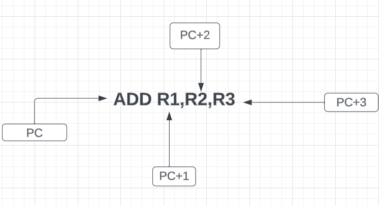
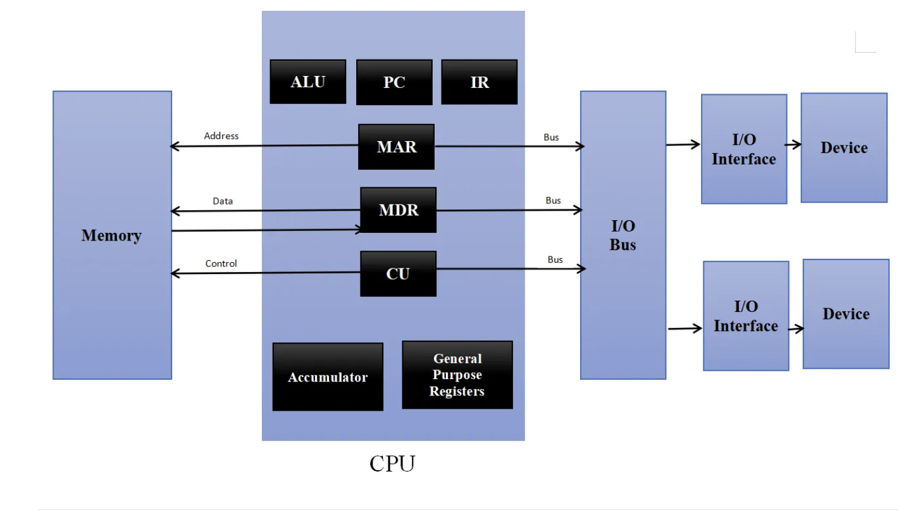

# Technical Specifications

| Role | Name | Signature | Date |
|---|---|---|---|
| Project Manager | Mattéo LEFIN|  |  |
| Program Manager | Gaël MALVAR |  |  |
| Tech Lead | Robin DEBRY |  |  |
| Software Developer | David CUAHONTE CUEVAS |  |  |
| Software Developer | Camille GAYAT  |  |  |
| Quality Assurance | Abderrazaq MAKRAN |  |  |
| Quality Assurance | Raphaël PROUDHON |  | |

<details>

<summary> Table of Content

</summary>

- [Technical Specifications](#technical-specifications)
  - [1. Introduction](#1-introduction)
    - [Document Purpose \& Definition](#document-purpose--definition)
    - [Glossary](#glossary)
    - [Project Overview](#project-overview)
      - [Project Brief](#project-brief)
    - [Setting up the development environment](#setting-up-the-development-environment)
      - [Hardware requirement](#hardware-requirement)
      - [Software requirement](#software-requirement)
      - [Coding methodology](#coding-methodology)
        - [➭ Workflow](#-workflow)
        - [➭ Coding conventions](#-coding-conventions)
        - [➭ Commenting conventions](#-commenting-conventions)
        - [➭ Documents conventions](#-documents-conventions)
        - [➭ Folders conventions](#-folders-conventions)
        - [➭ Test-Driven Development](#-test-driven-development)
      - [Assumptions and constraints](#assumptions-and-constraints)
  - [2.Technical Specifications](#2technical-specifications)
    - [Folder Structure](#folder-structure)
    - [Data Structures](#data-structures)
      - [Registers](#registers)
      - [CPU](#cpu)
      - [Instructions](#instructions)
    - [Software structure](#software-structure)

</details>

## 1. Introduction

### Document Purpose & Definition

The objective of the Technical Specifications is to translate the Functional Requirements, which delineate the features, scope, and objectives of the project. This involves breaking down each requirement into explicit instructions with utmost clarity. The purpose is to provide precise guidance to both the development and quality assurance teams, ensuring the successful accomplishment of their mission.

We strongly recommend a comprehensive review of the [Functional Specifications](../functional/functionalSpecifications.md)  before delving deeper into the Technical Specifications.

The primary aim of the Technical Requirements is to minimize ambiguity and prevent engineers from making uninformed decisions. To achieve this, we will address various functional and non-functional facets of the project. Simultaneously, we will make informed technological and architectural choices, evaluate their implications, measure associated risks and impacts, and compare them against alternative solutions.

This document is intended not only to assist the development team but also to provide valuable insights for other stakeholders and project owners. It serves as a reference for our methodology and may prove beneficial for future maintenance activities.

### Glossary

| Term | Definition |
|---|---|


### Project Overview

#### Project Brief

As stated in the Functional Requirements, the goal of the project is to create a virtual processor and an interpreter for running assembly code on that processor.

We have been given eight weeks to complete this project.

### Setting up the development environment

We will set up our development environment following the requirements as follow :

#### Hardware requirement

- Computer, the OS used is not important as long as it can run the required software.

#### Software requirement

- Any text editor but [Visual Studio Code](https://code.visualstudio.com/) is recommended.
- [Github](https://github.com/) or any control version system. Our team will use Github for this project especially [Github Desktop](https://desktop.github.com) it will be easier for all team members.
- We use the version 18 of C language called C18 also known as C17 because it is one of the most recent version of C language.
- We use [GCC](https://gcc.gnu.org/) as our compiler.

#### Coding methodology

##### ➭ Workflow

The development team started to work on the basic features of the project such as the basic logical operation, the basic arithmetic operation using these instructions

- ADD to make an addition.
- SUB to make a substraction.
- MUL to make a multiplication.
- DIV to make a division.

Once the Functional Specifications are dissected in the Technical Specifications, the functions and features of the project will be assigned to team members and priotised by either the project manager or the tech lead depending on the task.

For each functions and features the QA's team members will create Github Issues, those issues will be assigned to the team member in charge of the task.
We prefer to use the term of ticket more than issues as it is more representative of the work to be done.

Each ticket represents a chunk of work, a bug found, a feature request, an update. This abstraction allows to keep track of many types of tasks, break them down even more and allows to move forward swiftly.

##### ➭ Coding conventions

- All the code will be written in C language and we will use the C18 standard.
- Each functions name will be written in snake_case.
- Variable names will be written in camelCase.
- All variable will be written at the same place.
- All #define will be written in SNAKE_CASE and in uppercase.
- All #define will be written at the same place.

##### ➭ Commenting conventions

Comment all the functions to explain what they do.

##### ➭ Documents conventions

All the documents will be written in Markdown.
All their name will be written in camelCase.

##### ➭ Folders conventions

All the folders will be written in camelCase.

##### ➭ Test-Driven Development

We will use the Test-Driven Development methodology to develop our project.
For that we will create Assembly code files that will be used to test our project.
Each assembly code will test a specific part of the project for instance one assembly code will test the basic logical operation, another one will test the basic arithmetic operation and so on.

#### Assumptions and constraints

| Assumption | Constraints |
|---|---|
|The project assumes the use of the C programming language, utilizing the gcc compiler.|The project aims for portability across different platforms. However, specific platform-dependent features may limit absolute portability.|

## 2.Technical Specifications

### Folder Structure

All in **bold** are folders.

**`/interpreter`** Contains all the files related to the interpreter.

`main.c` Core of the project, contains the main function.

**`interpreter/headers`** Contains all the header files such as :

`machineCode.h` Contains the machine code.

`assembleCode.h` Permit to assemble the code.

`cpu.h` Contains the CPU.

**`/documents`** Contains all the documents related to the project in subfolders such as :

**`documents/Functional`** Contains all the documents related to the functional specifications such as :

`functionalSpecifications.md` Contains the functional specifications.

**`documents/functional/images`** Contains all the images for the functional specifications.

**`documents/technical`** Contains all the documents related to the technical specifications such as :

`technicalSpecifications.md` Contains the technical specifications.

**`documents/technical/images`** Contains all the images for the technical specifications.

**`Documents/Management`** Contains all the documents related to the management of the project such as :

`notion.md` Contains all the information about the project such as the KPI's, the gantt chart, the task list and the weekly reports.

**`documents/management/images`** Contains all the images for the management documents.

**`documents/management/WeeklyReport`** Contains all the weekly reports such as :

`weeklyReport1.md` Contains the weekly report 1.

`weeklyReport2.md` Contains the weekly report 2.

`weeklyReport3.md` Contains the weekly report 3.

`weeklyReport4.md` Contains the weekly report 4.

`weeklyReport5.md` Contains the weekly report 5.

`weeklyReport6.md` Contains the weekly report 6.

`weeklyReport7.md` Contains the weekly report 7.

`weeklyReport8.md` Contains the weekly report 8.

**`/qa`** Contains all the files related to the quality assurance which contains:

`testPlan.md` Contains the test plan.

**`/qa/template`**  Contains all the files related to the quality assurance template which contains:

`testCases.yml` Contains the template to create a test case.

`bugReport.yml` Contains the template to create a bug report.

**`/test`** Contains all the files related to the test which contains all the assembly code files like :

`testMain.asm` Contains a complex assembly with multiple function to ensure that is working as intended.

`testCpu.asm` Contains the assembly code to test the CPU.

`testStoreImm.asm` Contains the assembly code to test the store immediate value in a register.

`testCopy.asm` Contains the assembly code to test the copy of a register value to another register.

`testLoad.asm` Contains the assembly code to test the load of a value from memory into a register.

`testStoreAddr.asm` Contains the assembly code to test the store of the value of a register into memory address.

`testCompare.asm` Contains the assembly code to test the compare of two values.

`testJump.asm` Contains the assembly code to test the jump without condition.

`testJumpCond.asm` Contains the assembly code to test the jump with condition.

`testCall.asm` Contains the assembly code to test the call of a subroutine.

`testReturn.asm` Contains the assembly code to test the return from a subroutine.

`testArithm.asm` Contains the assembly code to test the arithmetic operations.

`testLogic.asm` Contains the assembly code to test the logical operations.

``` folder

|-- 2023-2024-project-3-virtual-processor-team-7 (root)
|   |-- interpreter
|   |   |-- headers
|   |   |   |-- machineCode.h
|   |   |-- main.c
|   |-- documents
|   |   |-- functional
|   |   |   |-- images
|   |   |   |   |-- functional1.png
|   |   |   |-- functionalSpecifications.md
|   |   |-- management
|   |   |   |-- images
|   |   |   |   |-- notion1.png
|   |   |   |-- notion.md
|   |   |   |-- weeklyReport
|   |   |   |   |-- weeklyReport1.md
|   |   |   |   |-- weeklyReport2.md
|   |   |   |   |-- weeklyReport3.md
|   |   |   |   |-- weeklyReport4.md
|   |   |   |   |-- weeklyReport5.md
|   |   |   |   |-- weeklyReport6.md
|   |   |   |   |-- weeklyReport7.md
|   |   |   |   |-- weeklyReport8.md
|   |   |-- technical
|   |   |   |-- images
|   |   |   |   |-- technical1.png
|   |   |   |-- technicalSpecifications.md
|   |-- qa
|   |   |-- images
|   |   |   |-- testPlan1.png
|   |   |-- testPlan.md
|   |-- test
|   |-- .gitignore
|   |-- README.md
|   |-- LICENSE
```

### Data Structures

#### Registers

We will use 16 registers to implement them we will use the program counter of the CPU.

PC is the program counter. It contains the address of the next instruction to be executed.
In this case PC will be always the instruction
it will be easier to use them in the functions.

#### CPU



- **PC** is the program counter. it provides the temporary housing for the next instruction that is to be executed in a string of instructions. As one instruction is retrieved and implemented, the program counter queues up the next instruction in the string, effectively minimizing delays in the execution of steps necessary to complete a task.
- **IR** is the instruction register. It contains the instruction that is currently being executed.
- **MAR** is the memory address register. It contains the address of the memory location to be accessed.
- **MDR** is the memory data register. It contains the data to be written to or read from the addressed location in memory.
- **ALU** is the arithmetic logic unit. It performs arithmetic and logical operations.
- **ACC** is the accumulator. It contains the result of the most recent arithmetic or logical operation performed by the ALU.
- **General Purpose Registers** are registers that can be used for any purpose. They are used to store operands, results, memory addresses, and so on it's for that we will use them to store the values of the registers.

We will use a struct to implement the CPU.
The CPU will have 6 registers, a memory of 100 bytes, a program counter, a stack and a stack pointer.

``` c

typedef struct {
    int registers[6]; 
    char memory[MEMORY_SIZE][100]; 
    int program_counter;
    int stack[MEMORY_SIZE];
    int stack_pointer;
} CPU;

```

#### Instructions

According to the [Functional Specifications](../functional/functionalSpecifications.md) we will use 20 instructions to implement them we will use the program counter of the CPU.
Now we will explain each instruction and how we will implement them.

- **MOV** : Move the value of a register to another register. To implement this instruction we will use :

    ``` c
    cpu->registers[machineCode[pc + 2]] = machineCode[pc + 1];
    ```

    with that the value of the register will be moved to another register.
<br>
- **ADD** : Add the value of a register to another register. To implement this instruction we will use :

    ``` c
    cpu->registers[machineCode[pc + 3]] = cpu->registers[machineCode[pc + 1]] + cpu->registers[machineCode[pc + 2]];
    ```

    With that the value of two registers will be added. The result will be stored in a third register.
<br>

- **SUB** : Substract the value of a register to another register. To implement this instruction we will use :

    ``` c
    cpu->registers[machineCode[pc + 3]] = cpu->registers[machineCode[pc + 1]] - cpu->registers[machineCode[pc + 2]];
    ```

    With that the value of two registers will be substracted. The result will be stored in a third register.
<br>
- **MUL** : Multiply the value of a register to another register. To implement this instruction we will use :

    ``` c
    cpu->registers[machineCode[pc + 3]] = cpu->registers[machineCode[pc + 1]] * cpu->registers[machineCode[pc + 2]];
    ```

    With that the value of two registers will be multiplied. The result will be stored in a third register.
<br>

- **DIV** : Divide the value of a register to another register. To implement this instruction we will use :

    ``` c
    cpu->registers[machineCode[pc + 3]] = cpu->registers[machineCode[pc + 1]] / cpu->registers[machineCode[pc + 2]];
    ```

    With that the value of two registers will be divided. The result will be stored in a third register.

<br>

- **CMP** : Compare the value of a register to another register. To implement this instruction we will use :

    ``` c
    if (cpu->registers[machineCode[pc + 1]] == cpu->registers[machineCode[pc + 2]]) {
        printf("The two values are equal\n")
    } else {
        printf("The two values are not equal\n")
    }
    ```

    With that the value of two registers will be compared. If the two values are equal the program will print "The two values are equal" else it will print "The two values are not equal". It's for the beginning with that you will be sure that is working as intended.
  
<br>

- **OR** : Logical OR between two registers. To implement this instruction we will use :

    ``` c
     cpu->registers[machineCode[pc + 3]] = cpu->registers[machineCode[pc + 1]] | cpu->registers[machineCode[pc + 2]];
    ```

    We use | to do a logical OR between two registers. The result will be stored in a third register.

<br>

- **AND** : Logical AND between two registers. To implement this instruction we will use :

    ``` c
     cpu->registers[machineCode[pc + 3]] = cpu->registers[machineCode[pc + 1]] & cpu->registers[machineCode[pc + 2]];
    ```

    We use & to do a logical AND between two registers. The result will be stored in a third register.

<br>

- **XOR** : Logical XOR between two registers. To implement this instruction we will use :

    ``` c
     cpu->registers[machineCode[pc + 3]] = cpu->registers[machineCode[pc + 1]] ^ cpu->registers[machineCode[pc + 2]];
    ```

    We use ^ to do a logical XOR between two registers. The result will be stored in a third register.

<br>

- **NOT** : Logical NOT between two registers. To implement this instruction we will use :

    ``` c
     cpu->registers[machineCode[pc + 2]] = ~cpu->registers[machineCode[pc + 1]];
    ```

    We use ~ to do a logical NOT between two registers. The result will be stored in a second register.
  
<br>

<!-- - **LOAD** : Load the value of a register to memory. To implement this instruction we will use :

    ``` c
    cpu->memory[machineCode[pc + 2]][machineCode[pc + 1]] = cpu->registers[machineCode[pc + 3]];
    ```

    With that the value of a register will be loaded to memory. -->

### Software structure

The software structure will be divided into 4 parts : The CPU, the machine code , the interpreter and the main.

- **CPU** : The CPU will be divided into 6 registers, a memory of 100 bytes, a program counter, a stack and a stack pointer. The stack will be used to store the return address of the subroutines. To structure the CPU we will use a struct. After that we will create a function to initialize the CPU. We will call it `initializeCPU()`and this function will take the structure of the CPU in parameter. Inside this function you will need to initialise registers of the CPU to 0, initialise the memory to 0, initialise the program counter to 0, initialise the stack to 0 and initialise the stack pointer to 0. It will looks something like that :

``` c
void initializeCPU(CPU *cpu)
{
    for (int i = 0; i < MEMORY_SIZE; i++)
    {
        cpu->registers[i] = 0;
    }
    for (int i = 0; i < MEMORY_SIZE; i++)
    {
        cpu->memory[i] = 0;
    }
    cpu->program_counter = 0;

    for (int i = 0; i < MEMORY_SIZE; i++)
    {
        cpu->stack[i] = 0;
    }
    cpu->stack_pointer = 0;
}
```

Don't forget to include the standard C library`#include <stdio.h>`, `#include <stdlib.h>` and `#include <string.h>`.

-

[⬆️ Back to top](#technical-specifications)
