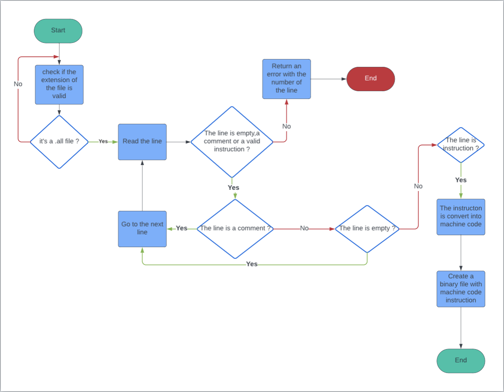

# Technical Specifications

| Role | Name | Signature | Date |
|---|---|---|---|
| Project Manager | Mattéo LEFIN|✅| 09/02/2024 |
| Program Manager | Gaël MALVAR |✅| 09/02/2024 |
| Tech Lead | Robin DEBRY |  |  |
| Software Developer | David CUAHONTE CUEVAS |✅| 09/02/2024|
| Software Developer | Camille GAYAT  |✅| 09/02/2024 |
| Quality Assurance | Abderrazaq MAKRAN | ✅ | 09/02/2024 |
| Quality Assurance | Raphaël PROUDHON | ✅ |09/02/2024 |

<details>

<summary> Table of Content </summary>

- [Technical Specifications](#technical-specifications)
  - [1. Introduction](#1-introduction)
    - [Document Purpose \& Definition](#document-purpose--definition)
    - [Glossary](#glossary)
    - [Project Overview](#project-overview)
      - [Project Brief](#project-brief)
    - [Setting up the development environment](#setting-up-the-development-environment)
      - [Hardware requirement](#hardware-requirement)
      - [Software requirement](#software-requirement)
      - [Coding methodology](#coding-methodology)
        - [➭ Workflow](#-workflow)
        - [➭ Coding conventions](#-coding-conventions)
        - [➭ Commenting conventions](#-commenting-conventions)
        - [➭ Documents conventions](#-documents-conventions)
        - [➭ Folders conventions](#-folders-conventions)
        - [➭ Test-Driven Development](#-test-driven-development)
      - [Assumptions and constraints](#assumptions-and-constraints)
  - [2.Technical Specifications](#2technical-specifications)
    - [Folder Structure](#folder-structure)
    - [Data Structures](#data-structures)
      - [Registers](#registers)
      - [CPU](#cpu)
      - [Instructions](#instructions)
    - [Software structure](#software-structure)
      - [Error Handling](#error-handling)

</details>

## 1. Introduction

### Document Purpose & Definition

The objective of the Technical Specifications is to translate the Functional Requirements, which delineate the features, scope, and objectives of the project. This involves breaking down each requirement into explicit instructions with utmost clarity. The purpose is to provide precise guidance to both the development and quality assurance teams, ensuring the successful accomplishment of their mission.

We strongly recommend a comprehensive review of the [Functional Specifications](../functional/functionalSpecifications.md)  before delving deeper into the Technical Specifications.

The primary aim of the Technical Requirements is to minimize ambiguity and prevent engineers from making uninformed decisions. To achieve this, we will address various functional and non-functional facets of the project. Simultaneously, we will make informed technological and architectural choices, evaluate their implications, measure associated risks and impacts, and compare them against alternative solutions.

This document is intended not only to assist the development team but also to provide valuable insights for other stakeholders and project owners. It serves as a reference for our methodology and may prove beneficial for future maintenance activities.

### Glossary

| Term | Definition |links|
|------|------------|-----|
|Central Processing Unit (CPU)|The central processing unit (CPU) is the unit which performs most of the processing inside a computer.|[Wikipedia](https://en.wikipedia.org/wiki/Central_processing_unit)|
|Arithmetic Logic Unit (ALU)|The arithmetic logic unit (ALU) is a digital circuit within the CPU that performs arithmetic and logical operations.|[Techtarget](https://www.techtarget.com/whatis/definition/arithmetic-logic-unit-ALU)|
|Memory Address Register (MAR)|The memory address register (MAR) is the CPU register that either stores the memory address from which data will be fetched to the CPU, or the address to which data will be sent and stored.|[Studysmarter](https://www.studysmarter.co.uk/explanations/computer-science/computer-organisation-and-architecture/memory-address-register/)|
|Memory Data Register (MDR)|The memory data register (MDR) is the CPU register that either stores the data to be written to the memory or the data that was read from the memory.|[Studysmarter](https://www.studysmarter.co.uk/explanations/computer-science/computer-organisation-and-architecture/memory-data-register/)|
|Accumulator (ACC)|The accumulator is a register in the CPU that stores the result of an arithmetic or logical operation.|[Techopedia](https://www.techopedia.com/definition/2456/accumulator)|
|Operating System (OS)|An operating system (OS) is system software that manages computer hardware, software resources, and provides common services for computer programs.|[More information](https://en.wikipedia.org/wiki/Operating_system)|
|Integrated Development Environment (IDE)|An integrated development environment (IDE) is a software application that provides comprehensive facilities to computer programmers for software development.|[AWS Amazon](https://aws.amazon.com/what-is/ide/)|
|Binary File|A binary file is a computer file that is not a text file. The term "binary file" is often used as a term meaning "non-text file".|[Wikipedia](https://en.wikipedia.org/wiki/Binary_file)|
|Machine Code|Machine code is a computer program written in machine language instructions that can be executed directly by a computer's central processing unit (CPU).|[Market business news](https://marketbusinessnews.com/financial-glossary/machine-code/)|
|Assembly Code|Assembly code is a low-level programming language for a computer, or other programmable device, in which there is a very strong (generally one-to-one) correspondence between the language and the architecture's machine code instructions.|[Investopedia](https://www.investopedia.com/terms/a/assembly-language.asp)|
|Subroutine|A subroutine is a sequence of program instructions that performs a specific task, packaged as a unit. This unit can then be used in programs wherever that particular task should be performed.|[Wikipedia](https://en.wikipedia.org/wiki/Subroutine)|
|Stack|A stack is a linear data structure that follows the Last In First Out (LIFO) principle.|[Prebytes](https://www.prepbytes.com/blog/stacks/stack-pointer-types-applications-and-operations/)|
|Stack Pointer|A stack pointer is a small register that stores the address of the last program request in a stack.|[Prepbytes](https://www.prepbytes.com/blog/stacks/stack-pointer-types-applications-and-operations/)|
|Overflow|An overflow occurs when a computer program attempts to store data beyond the boundaries of a fixed-length storage buffer.| [Wikipedia](https://en.wikipedia.org/wiki/Buffer_overflow)|
|Portability|Portability is the ability of a computer program to be executed in multiple environments.|[Developerexperience](https://developerexperience.io/articles/software-portability#)|

### Project Overview

#### Project Brief

As stated in the Functional Requirements, the goal of the project is to create a virtual processor and an interpreter for running assembly code on that processor.

We have been given eight weeks to complete this project.

### Setting up the development environment

We will set up our development environment following the requirements as follow :

#### Hardware requirement

- Computer, the OS used is not important as long as it can run the required software.

#### Software requirement

- Any integrated development environment (IDE) but [Visual Studio Code](https://code.visualstudio.com/) is recommended.
- [Github](https://github.com/) or any control version system. Our team will use Github for this project especially [Github Desktop](https://desktop.github.com) it will be easier for all team members.
- We use version 18 of C language called C18 also known as C17 because it is one of the most recent versions of C language.
- We use [GCC](https://gcc.gnu.org/) 13.2 as our compiler.

#### Coding methodology

##### ➭ Workflow

The development team started to work on the basic features of the project such as the basic logical operation, the basic arithmetic operation using these instructions

- ADD to make an addition.
- SUB to make a subtraction.
- MUL to make a multiplication.
- DIV to make a division.

Once the Functional Specifications are dissected in the Technical Specifications, the functions and features of the project will be assigned to team members and prioritised by either the project manager or the tech lead depending on the task.

For each function and feature the QA's team members will create Github Issues, and those issues will be assigned to the team member in charge of the task.
We prefer to use the term ticket more than issues as it is more representative of the work to be done.

Each ticket represents a chunk of work, a bug found, a feature request, and an update. This abstraction allows us to keep track of many types of tasks, break them down even more and move forward swiftly.

##### ➭ Coding conventions

- All the code will be written in C language and we will use the C18 standard.
- Each function's name will be written in snake_case.
- Variable names will be written in camelCase.
- All variables will be written in the same place.
- All #define will be written in SNAKE_CASE and in uppercase.
- All #define will be written in the same place.

##### ➭ Commenting conventions

Comment all the functions to explain what they do.

``` c
/**
 * @brief This function is used to initialize the CPU.
 * 
 * @param cpu The CPU to initialize.
 */
// Here your function
```

##### ➭ Documents conventions

All the documents will be written in Markdown.
All their name will be written in camelCase.

##### ➭ Folders conventions

All the folders will be written in camelCase.

##### ➭ Test-Driven Development

We will use the Test-Driven Development methodology to develop our project.
For that, we will create Assembly code files that will be used to test our project.
Each assembly code will test a specific part of the project for instance one assembly code will test the basic logical operation, another one will test the basic arithmetic operation and so on.

#### Assumptions and constraints

| Assumption | Constraints |
|---|---|
|The project assumes the use of the C programming language, utilizing the gcc compiler.|The project aims for portability across different platforms. However, specific platform-dependent features may limit absolute portability.|

## 2.Technical Specifications

### Folder Structure

All in **bold** are folders.

**`/.github/ISSUE_TEMPLATE`** Contains all the files related to the issue template.

`bugReport.yml` Contains the bug report template.

`testCase.yml` Contains the test case template.

**`/interpreter`** Contains all the files related to the interpreter.

`main.c` The core of the project, contains the main function.

**`interpreter/headers`** Contains all the header files such as :

`cpu.h` Contains the CPU.

`executeInstruction.h` Contains the function to execute the instruction.

`parser.h` Contains the parser.

**`/binary`** Contains all the files related to the binary such as :

`output.bin` Contains the binary output.

`binaryConverter.c` Contains the function to convert the binary.

**`/documents`** Contains all the documents related to the project in subfolders such as :

**`documents/Functional`** Contains all the documents related to the functional specifications such as :

`functionalSpecifications.md` Contains the functional specifications.

**`documents/functional/images`** Contains all the images for the functional specifications.

**`documents/technical`** Contains all the documents related to the technical specifications such as :

`technicalSpecifications.md` Contains the technical specifications.

**`documents/technical/images`** Contains all the images for the technical specifications.

**`Documents/Management`** Contains all the documents related to the management of the project such as :

`notion.md` Contains all the information about the project such as the KPIs, the Gantt chart, the task list and the weekly reports.

**`documents/management/images`** Contains all the images for the management documents.

**`documents/management/WeeklyReport`** Contains all the weekly reports such as :

`weeklyReport1.md` Contains the weekly report 1 and so on.

**`/qa`** Contains all the files related to quality assurance which contain:

`testPlan.md` Contains the test plan.

**`qa/images`** Contains all the images for the test plan.

**`/test`** Contains all the files related to the test which contains all the assembly code files like :

`testMain.all` Contains a complex assembly with multiple functions to ensure that is working as intended.

`testCpu.all` Contains the assembly code to test the CPU.

`testStoreImm.all` Contains the assembly code to test the store's immediate value in a register.

`testCopy.all` Contains the assembly code to test the copy of a register value to another register.

`testLoad.all` Contains the assembly code to test the load of a value from memory into a register.

`testStore.all` Contains the assembly code to test the store of the value of a register into the memory address.

`testCmp.all` Contains the assembly code to test the comparison of two values.

`testJump.all` Contains the assembly code to test the jump without condition.

`testJumpCond.all` Contains the assembly code to test the jump with the condition.

`testCall.all` Contains the assembly code to test the call of a subroutine.

`testReturn.all` Contains the assembly code to test the return from a subroutine.

`testArithm.all` Contains the assembly code to test the arithmetic operations.

`testLogic.all` Contains the assembly code to test the logical operations.

```folder

|-- 2023-2024-project-3-virtual-processor-team-7 (root)
|   └-- .github
|   |   └-- ISSUE_TEMPLATE
|   |   |   └-- bugReport.yml
|   |   |   └-- testCase.yml
|   └-- interpreter
|   |   └-- headers
|   |   |   └-- cpu.h
|   |   |   └-- executeInstruction.h
|   |   |   └-- parser.h
|   |   └-- main.c
|   └-- binary
|   |   └-- output.bin
|   |   └-- binaryConverter.c
|   └-- documents
|   |   └-- functional
|   |   |   └-- images
|   |   |   |   └-- functional1.png
|   |   |   └-- functionalSpecifications.md
|   |   └-- management
|   |   |   └-- images
|   |   |   |   └-- notion1.png
|   |   |   └-- notion.md
|   |   |   └-- weeklyReport
|   |   |   |   |-- weeklyReport1.md
|   |   └-- technical
|   |   |   └-- images
|   |   |   |   └-- technical1.png
|   |   |   └-- technicalSpecifications.md
|   └-- qa
|   |   |-- images
|   |   |   |-- testPlan1.png
|   |   |-- testPlan.md
|   └-- test
|   |   |-- testMov.all
|   |   |-- testPrint.all
|   |   |-- testAdd.all
|   |   |-- testSub.all
|   |   |-- testMul.all
|   |   |-- testDiv.all
|   |   |-- testCmp.all
|   |   |-- testOr.all
|   |   |-- testAnd.all
|   |   |-- testXor.all
|   |   |-- testNot.all
|   |   |-- testLoad.all
|   |   |-- testStore.all
|   |   |-- testJump.all
|   |   |-- testJumpCond.all
|   |   |-- testCall.all
|   |   └-- testReturn.all
|   |
|   └-- .gitignore
|   └-- README.md
|   └-- LICENSE
```

### Data Structures

#### Registers

We will use 16 registers to implement them we will use the program counter of the CPU.


PC is the program counter. It contains the address of the next instruction to be executed.
In this case PC will be always the instruction
it will be easier to use them in the functions.

#### CPU


- **PC** is the program counter. it provides the temporary housing for the next instruction that is to be executed in a string of instructions. As one instruction is retrieved and implemented, the program counter queues up the next instruction in the string, effectively minimizing delays in the execution of steps necessary to complete a task.
- **IR** is the instruction register. It contains the instruction that is currently being executed.
- **MAR** is the memory address register. It contains the address of the memory location to be accessed.
- **MDR** is the memory data register. It contains the data to be written to or read from the addressed location in memory.
- **ALU** is the arithmetic logic unit. It performs arithmetic and logical operations.
- **ACC** is the accumulator. It contains the result of the most recent arithmetic or logical operation performed by the ALU.
- **General Purpose Registers** are registers that can be used for any purpose. They are used to store operands, results, memory addresses, and so on. We will use them to store the values of the registers.

We will use a struct to implement the CPU.
The CPU will have 6 registers, the memory, a program counter, a stack and a stack pointer.

``` c

typedef struct {
    int registers[6]; 
    char memory[MEMORY_SIZE][100]; 
    int program_counter;
    int stack[MEMORY_SIZE];
    int stack_pointer;
} CPU;

```

#### Instructions

According to the [Functional Specifications](../functional/functionalSpecifications.md), we will use 20 instructions to implement them we will use the program counter of the CPU.
Now we will explain each instruction and how we will implement them.

- **MOV**: Move the value of a register to another register. To implement this instruction we will
  - set the value in cpu->registers at the index specified by machineCode[pc + 2] to the value from machineCode[pc + 1].
  - With that, the value of the register will be moved to another register.

<br>

- **ADD**: Add the value of a register to another register. To implement this instruction we will
  - set the value in cpu->registers at the index specified by machineCode[pc + 3] to the sum of the values in cpu->registers at the indices specified by machineCode[pc + 1] and machineCode[pc + 2].
  - With that, the value of two registers will be added. The result will be stored in a third register.

<br>

- **SUB**: Subtract the value of a register to another register. To implement this instruction we will
  - set the value in cpu->registers at the index specified by machineCode[pc + 3] to the result of subtracting the value in cpu->registers at the index specified by machineCode[pc + 2] from the value in cpu->registers at the index specified by machineCode[pc + 1].
  - With that, the value of two registers will be subtracted. The result will be stored in a third register.

<br>

- **MUL**: Multiply the value of a register to another register. To implement this instruction we will
  - set the value in cpu->registers at the index specified by machineCode[pc + 3] to the result of multiplying the value in cpu->registers at the index specified by machineCode[pc + 1] by the value in cpu->registers at the index specified by machineCode[pc + 2].
  - With that, the value of two registers will be multiplied. The result will be stored in a third register.

<br>

- **DIV**: Divide the value of a register to another register. To implement this instruction we will
  - set the value in cpu->registers at the index specified by machineCode[pc + 3] to the result of dividing the value in cpu->registers at the index specified by machineCode[pc + by the value in cpu->registers at the index specified by machineCode[pc + 2].
  - With that, the value of the two registers will be divided. The result will be stored in a third register.

<br>

- **CMP**: Compare the value of a register to another register. To implement this instruction we will
  - check if the value in cpu->registers at the index specified by machineCode[pc + 1] is equal to the value in cpu->registers at the index specified by machineCode[pc + 2].
  - With that,the value of the two registers will be compared.
  If the two values are equal the program will print "The two values are equal" else it will print "The two values are not equal". It's for the beginning that you will be sure that is working as intended.
  
<br>

- **OR**: Logical OR between two registers. To implement this instruction we will
  - set the value in cpu->registers at the index specified by machineCode[pc + 3] to the result of bitwise OR operation between the value in cpu->registers at the index specified by machineCode[pc + 1] and the value in cpu->registers at the index specified by machineCode[pc + 2].
  - We use | to do a logical OR between two registers. The result will be stored in a third register.

<br>

- **AND**: Logical AND between two registers. To implement this instruction we will
  - set the value in cpu->registers at the index specified by machineCode[pc + 3] to the result of bitwise AND operation between the value in cpu->registers at the index specified by machineCode[pc + 1] and the value in cpu->registers at the index specified by machineCode[pc + 2].
  - We use & to do a logical AND between two registers. The result will be stored in a third register.

<br>

- **XOR**: Logical XOR between two registers. To implement this instruction we will:
  - Set the value in cpu->registers at the index specified by machineCode[pc + 3] to the result of bitwise XOR operation between the value in cpu->registers at the index specified by machineCode[pc + 1] and the value in cpu->registers at the index specified by machineCode[pc + 2].
  - We use ^ to do a logical XOR between two registers. The result will be stored in a third register.

<br>

- **NOT**: Logical NOT between two registers. To implement this instruction we will
  - Set the value in cpu->registers at the index specified by machineCode[pc + 2] to the bitwise complement (NOT) of the value in cpu->registers at the index specified by machineCode[pc + 1].
  - We use ~ to do a logical NOT between two registers. The result will be stored in a second register.
  
<br>

- **LOAD**: Load the value of a register to memory. To implement this instruction we will
  - Set the value in cpu->memory at the index specified by machineCode[pc + 2] and machineCode[pc + 1] to the value in cpu->registers at the index specified by machineCode[pc + 3].
  - With that, the value of a register will be loaded to memory.

<br>

- **STORE**: Store the value of a memory in a register. To implement this instruction we will
  - Set the value in cpu->registers at the index specified by machineCode[pc + 3] to the value stored in cpu->memory at the index specified by machineCode[pc + 2] and machineCode[pc + 1].
  - With that, the value of a memory will be stored in a register.

<br>

- **JMP**: Jump to a specific address. To implement this instruction we will
  - Set the program counter (pc) of the CPU to the value specified by machineCode[pc + 1].
  - With that, the program counter will jump to a specific address.

<br>

Now we will explain the jump with condition instructions.

- **JMPT**: Jump to a specific address if the value of a register is true. To implement this instruction we will
  - Check if the value in cpu->registers at the index specified by machineCode[pc + 1] is equal to 1
  - If true, set the program counter (pc) of the CPU to the value specified by machineCode[pc + 2]
  - With that, the program counter will jump to a specific address if the value of a register is true.
  
<br>

- **JMPF**: Jump to a specific address if the value of a register is false. To implement this instruction we will
  - Check if the value in cpu->registers at the index specified by machineCode[pc + 1] is equal to 0
  - If true, set the program counter (pc) of the CPU to the value specified by machineCode[pc + 2]
  - With that, the program counter will jump to a specific address if the value of a register is false.
  
<br>

- **CALL**: Call a subroutine. To implement this instruction we will
  - Store the current program counter (pc) incremented by 2 in the CPU stack
  - Increment the stack pointer
  - Set the program counter (pc) of the CPU to the value specified by machineCode[pc + 1]
  - With that, the program counter will jump to a specific address and the return address will be stored in the stack.

- **RET**: Return from a subroutine. To implement this instruction we will
  - Decrement the stack pointer.
  - Set the program counter (pc) of the CPU to the value stored in the CPU stack at the current stack pointer.
  - With that, the program counter will jump to the return address stored in the stack.

### Software structure

The software structure will be divided into 5 parts: The CPU, the parser, the executeInstruction, and the main.

- **CPU**: The CPU will be divided into 6 registers, a memory of 2^16 bytes that you need to define before all so it will be 65536 bytes, a program counter, a stack and a stack pointer. The stack will be used to store the return address of the subroutines. To structure the CPU we will use a struct. After that, we will create a function to initialize the CPU. We will call it `initializeCPU()`and this function will take the structure of the CPU in parameter. Inside this function, you will need to initialise registers of the CPU to 0, initialise the memory to 0, initialise the program counter to 0, initialise the stack to 0 and initialise the stack pointer to 0. It will look something like this:

``` c
// Initialize CPU registers to zero
for each register in cpu->registers {
    register = 0;
}

// Initialize CPU memory to zero
for each memory_location in cpu->memory {
    memory_location = 0;
}

// Set the program counter (pc) of the CPU to zero
cpu->program_counter = 0;

// Initialize CPU stack to zero
for each stack_entry in cpu->stack {
    stack_entry = 0;
}

// Set the stack pointer (sp) of the CPU to zero
cpu->stack_pointer = 0;
```

Don't forget to include the standard C library`#include <stdio.h>`, `#include <stdlib.h>` and `#include <string.h>`.

- **Parser**: The parser will be used to parse the assembly code. First of all, we need a structure to store the labels for their name and their addresses in memory. We will call it `Label`. After that, we will need a function to parse the assembly code. We will call it `parse()`
it will take the file in parameter, it will take also the array for the machine code and the machine code size at the beginning of this function you need to initialise the line which is an array of characters that will permit you to read the file line by line. After that, you need to initialise the index that will permit to assign the machine code when the parser finds a precise instruction according to the machine decided in the [functional specification](../functional/functionalSpecifications.md). After that, we need to initialise the label count and the label address to manage the jump instruction.

``` c
Define a structure Label {
    char name[256];
    int address;
} Declare an array labels of size 100 with elements of type Label;

Function parser(file, machineCode, machineCodeSize) {
    Declare a string line with a maximum length of 256 characters;
    Declare an integer index and initialize it to 0;
    Declare an integer currentAddress and initialize it to 0;
    Declare an integer labelCount and initialize it to 0;
```

After that, you will need a while loop to parse each line.

⚠️ **Don't forget to manage the comments and empty lines** ⚠️

After that, you will create a token for each instruction you encounter. It will permit the program to know which instruction you encounter and which register will be a source or a destination register.

Now let's a diagram to better understand the parser.



- **executeInstruction**: This part will be used to execute the instruction. To do that we need a function to execute the instruction. We will call it `executeInstruction()` it will take the CPU in parameter and the machine code. After that, we will need a while to be sure that the program doesn't find an halt instruction. Inside this while loop we will need a switch case to execute the instruction. It will look something like this :

``` c

Function executeInstruction(cpu, machineCode) {
    Declare an integer pc and initialize it to 0;

    // Infinite loop to continuously execute instructions
    Loop indefinitely {
        // Switch statement to handle different instruction opcodes
        Switch on machineCode[pc] {
            Case 0x20: // Instruction opcode for MOV
                If machineCode[pc + 1] > 255 {
                    // Detect overflow in MOV
                    Print "Overflow in MOV detected\n";
                    Return;
                } Else {
                    // Execute MOV instruction
                    Set the value in cpu->registers at the index specified by machineCode[pc + 2]
                    to the value specified by machineCode[pc + 1];
                    Print "MOV " followed by the value specified by machineCode[pc + 1]
                    and "R" followed by the index specified by machineCode[pc + 2];
                    Increment pc by 3;
                }
                Break; // Break out of the switch statement
        }
    }
}

```

This is an example of the MOV instruction. You need to do the same for the other instructions.

- **Main**: This part will be used to read all assembly like language (all) files put in the argument when you execute the program. For example to launch the program you will need to be in the interpreter folder and execute the command :

    ``` bash
    ./main <PathToYourFile.all> <PathToYourFileOutput.bin>
    ```

    After that, you will need to open the file and check if the file exists. If the file exists you will need to call the function `parse()` to parse the assembly code. ⚠️ **Don't forget to close the file**⚠️. We need also to write the machine code to a binary file to do that we will use the function `fwrite()` Which will look something like this:

``` c
Function main(argc, argv) {
    // Check if the correct number of command-line arguments are provided
    If argc is not equal to 3 {
        Print usage information;
        Return 1; // Exit with error status
    }

    // Open the input assembly code file
    Declare a FILE pointer inputFile and open the file specified by argv[1] in read mode;
    If inputFile is NULL {
        Print error message indicating failure to open the input file;
        Return 1; // Exit with error status
    }

    // Open the output binary file
    Declare a FILE pointer outputFile and open the file specified by argv[2] in binary write mode;
    If outputFile is NULL {
        Print error message indicating failure to open the output file;
        Close inputFile;
        Return 1; // Exit with error status
    }

    // Declare variables to store machine code and its size
    Declare an array machineCode of size MEMORY_SIZE to store the machine code;
    Declare an integer machineCodeSize;

    // Parse the input assembly code file and generate machine code
    Call the parser function with the inputFile, machineCode, and a reference to machineCodeSize;

    // Write the machine code to the output binary file
    For each element i in machineCode up to machineCodeSize {
        Write the value of machineCode[i] to the outputFile;
    }

    // Close the input and output files
    Close inputFile;
    Close outputFile;

    Return 0; // Exit with success status
}

```

With that, you will be able to read the assembly code like (.all) and transform it into machine code and write it into a binary file.

Now you have all the structure of the software to implement the interpreter part of the project. It still needs to implement the reading of the binary file and the execution of the machine code.

To do that you will need a function to read and execute the binary file. We will call it `executeBinary()` it will take the CPU in parameter and the binary file. After that, you will need to open the file and check if the file exists. If the file exists you will need to call the function `initializeCPU()` to initialize the CPU. Further beyond that, you will need to call the function `executeInstruction()` to execute the machine code. ⚠️ **Don't forget to close the file**⚠️.

```c

Function main(argc, argv) {
    // Check if the correct number of command-line arguments are provided
    If argc is not equal to 2 {
        Print usage information;
        Return 1; // Exit with error status
    }

    // Open the binary file
    Declare a FILE pointer binaryFile and open the file specified by argv[1] in binary read mode;
    If binaryFile is NULL {
        Print error message indicating failure to open the binary file;
        Return 1; // Exit with error status
    }

    // Create a CPU instance and initialize it
    Declare a CPU structure instance cpu;
    Call the initializeCPU function with a reference to cpu;

    // Determine the size of the binary file
    Seek to the end of the binary file;
    Get the current position in the file, which represents the file size;
    Rewind the binary file to the beginning;

    // Allocate memory to store the machine code
    Declare a pointer machineCode of type unsigned char and allocate memory with size equal to fileSize;

    If machineCode is NULL {
        Print memory allocation error message;
        Close binaryFile;
        Return 1; // Exit with error status
    }

    // Read the machine code from the binary file into memory
    Read fileSize bytes from binaryFile into machineCode;

    // Close the binary file
    Close binaryFile;

    // Open the binary file again for writing (clear its contents)
    Open the file specified by argv[1] in binary write mode;
    Close binaryFile;

    // Execute the program using the CPU and machine code
    Call the executeProgram function with the cpu and machineCode;

    // Free the allocated memory for machineCode
    Free machineCode;

    Return 0; // Exit with success status
}
```

⚠️ **Don't forget to include header files that you need when you write the code.** ⚠️

To explain more clearly the whole project will be divided into three big parts: the assembly like language code part, the interpreter part and the binary part. It will seem like this:


#### Error Handling

We will use the following error handling strategy:

- **Error Messages**: We will use descriptive error messages to help the user understand what went wrong. For example, if the program encounters an error while reading an assembly code file, it will print "Error reading file" to the console. If the program encounters an error while opening a binary file, it will print "Error opening file" to the console. Further beyond if the program encounters an error of assembly like an overflow it will print "Overflow detected" to the console. If the problem is with an instruction it will print "Error with the instruction" to the console you need to explain at which line the error is detected to help the user understand what went wrong.

[⬆️ Back to top](#technical-specifications)
